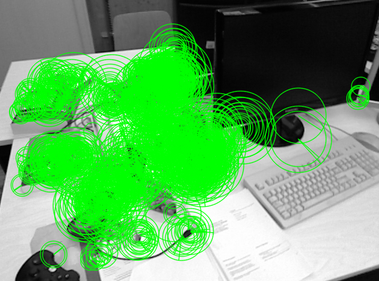
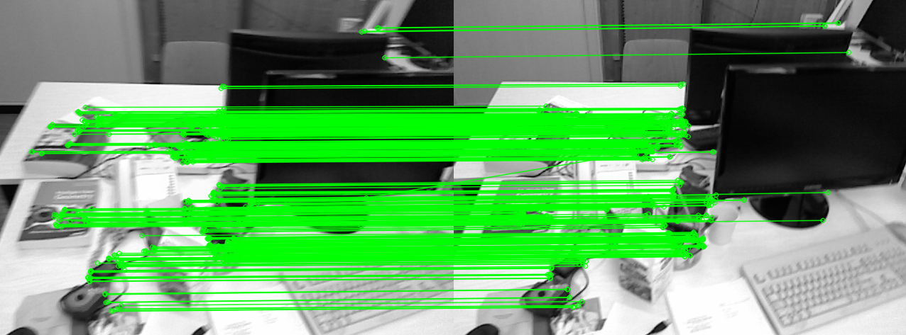
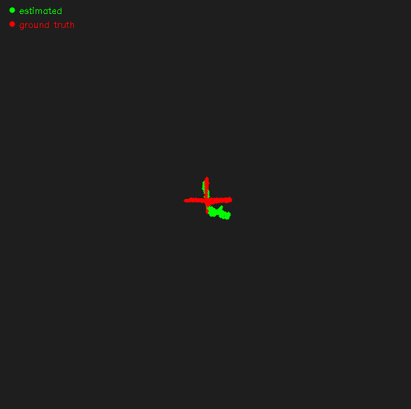
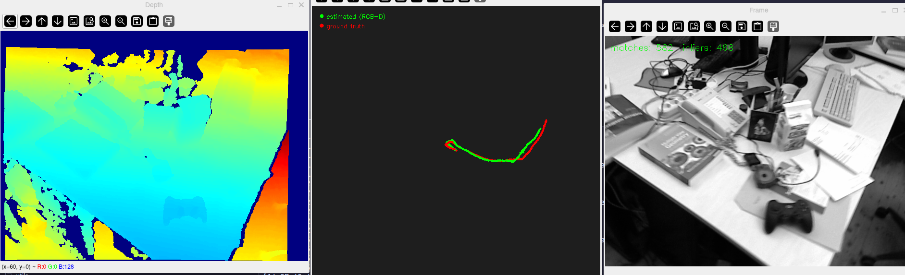

# slam-cpp

A C++ visual odometry and SLAM project built from scratch for learning purposes.
Implements the core pipeline of a monocular visual SLAM system step by step,
using the TUM RGB-D dataset for evaluation.

## Status

- [x] Phase 1 — Visual Odometry
  - [x] TUM RGB-D dataset loader
  - [x] ORB feature detection
  - [x] Feature matching
  - [x] Monocular pose estimation (essential matrix, up-to-scale)
  - [x] RGB-D pose estimation (PnP, metric scale)
- [ ] Phase 2 — Mapping
- [ ] Phase 3 — Loop closure

## Dependencies

| Library | Purpose | Install |
|---|---|---|
| OpenCV | Image processing, feature detection, visualization | `sudo pacman -S opencv` |
| libavif | OpenCV AVIF image support | `sudo pacman -S libavif` |
| Qt6 | OpenCV GUI backend for imshow | `sudo pacman -S qt6-base` |
| VTK | OpenCV viz module | `sudo pacman -S vtk` |
| spdlog | Logging | Managed by xmake |

> Developed and tested on Arch Linux (WSL2). Ubuntu/Debian users should
> replace `pacman -S` with `apt install` and adjust package names accordingly.

## Build

This project uses [xmake](https://xmake.io) as the build system.
```bash
# install xmake
curl -fsSL https://xmake.io/shget.text | bash

# clone and build
git clone https://github.com/AdrianMelendez/slam-cpp.git
cd slam-cpp
xmake
```

## Dataset

Download the TUM RGB-D `fr1/xyz` sequence:
```bash
mkdir data && cd data
wget https://cvg.cit.tum.de/rgbd/dataset/freiburg1/rgbd_dataset_freiburg1_xyz.tgz
tar -xzf rgbd_dataset_freiburg1_xyz.tgz
```

## Usage
```bash
# play raw image sequence
xmake run image_viewer $(pwd)/data/rgbd_dataset_freiburg1_xyz
```
```bash
# play sequence with ORB feature detection overlay
xmake run feature_viewer $(pwd)/data/rgbd_dataset_freiburg1_xyz
```

```bash
# play sequence feature matching from one frame to the next
xmake run feature_matcher $(pwd)/data/rgbd_dataset_freiburg1_xyz
```

```bash
# estimate position from monocular image
xmake run pose_viewer $(pwd)/data/rgbd_dataset_freiburg1_xyz
```

```bash
# estimate position using RGB + Depth (metric scale, no calibration needed)
xmake run pose_viewer_rgbd $(pwd)/data/rgbd_dataset_freiburg1_xyz
```


Press `q` to quit either viewer.

## Project structure
```
src/
├── apps/
│   ├── image_viewer.cpp         # raw image sequence player
│   ├── feature_viewer.cpp       # ORB feature detection viewer
│   ├── feature_matcher.cpp      # feature matching viewer
│   ├── pose_viewer.cpp          # monocular pose estimation viewer
│   └── pose_viewer_rgbd.cpp     # RGB-D pose estimation viewer
├── frontend/
│   ├── feature_detector         # ORB keypoint and descriptor extraction
│   ├── feature_matcher          # descriptor matching between frames
│   ├── monocular_pose_estimator # essential matrix pose (up-to-scale)
│   └── rgbd_pose_estimator      # PnP pose from depth backprojection (metric)
├── io/
│   └── tum_loader               # TUM RGB-D dataset parser
└── utils/
    └── logger                   # spdlog initialization
```

## References

- [TUM RGB-D Dataset](https://cvg.cit.tum.de/data/datasets/rgbd-dataset)
- [ORB-SLAM2 paper](https://arxiv.org/abs/1610.06475)
- [Multiple View Geometry in Computer Vision — Hartley & Zisserman](https://www.robots.ox.ac.uk/~vgg/hzbook/)
